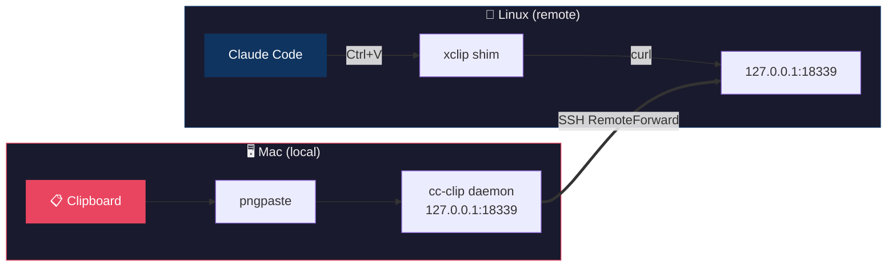

<p align="center">
  
</p>
<h1 align="center">cc-clip</h1>
<p align="center">
  <b>Paste images into remote Claude Code over SSH — as if it were local.</b>
</p>
<p align="center">
  <a href="https://github.com/ShunmeiCho/cc-clip/releases"></a>
  <a href="LICENSE"></a>
  <a href="https://go.dev"></a>
  <a href="https://github.com/ShunmeiCho/cc-clip/stargazers"></a>
</p>

<!-- TODO: Replace with actual GIF demo
<p align="center">
  
  <br>
  <em>Copy screenshot on Mac → SSH to remote → Ctrl+V in Claude Code → image appears</em>
</p>
-->

## The Problem

When running Claude Code on a remote server via SSH, **Ctrl+V image paste doesn't work**. The remote `xclip` reads the server's clipboard, not your local Mac's. No screenshots, no diagrams, no visual context — you're stuck with text-only.

## The Solution

```
Mac clipboard  →  cc-clip daemon  →  SSH tunnel  →  xclip shim  →  Claude Code
```

One command. No changes to Claude Code. No terminal-specific hacks. Works everywhere.

## Quick Start

```bash
# Install
curl -fsSL https://raw.githubusercontent.com/ShunmeiCho/cc-clip/main/scripts/install.sh | sh

# Setup (one command does everything)
cc-clip setup myserver
```

Done. `Ctrl+V` in remote Claude Code now pastes images from your Mac.

## Why cc-clip?

| Approach | Works over SSH? | Any terminal? | Image support? | Setup complexity |
|----------|:-:|:-:|:-:|:--:|
| Native Ctrl+V | Local only | Some | Yes | None |
| X11 Forwarding | Yes (slow) | N/A | Yes | Complex |
| OSC 52 clipboard | Partial | Some | Text only | None |
| **cc-clip** | **Yes** | **Yes** | **Yes** | **One command** |

## How It Works



1. **Local daemon** reads your Mac clipboard via `pngpaste`, serves images over HTTP on loopback
2. **SSH RemoteForward** tunnels the daemon port to the remote server
3. **xclip shim** intercepts only the clipboard calls Claude Code makes, fetches images through the tunnel, passes everything else to the real `xclip`

## Security

| Layer | Protection |
|-------|-----------|
| Network | Loopback only (`127.0.0.1`) — never exposed |
| Auth | Bearer token with 30-day sliding expiration (auto-renews on use) |
| Token delivery | Via stdin, never in command-line args |
| Transparency | Non-image calls pass through to real `xclip` unchanged |

## Commands

| Command | Description |
|---------|-------------|
| `cc-clip setup <host>` | **Full setup**: deps, SSH config, daemon, deploy |
| `cc-clip connect <host>` | Deploy to remote (incremental) |
| `cc-clip connect <host> --token-only` | Sync token only (fast) |
| `cc-clip doctor --host <host>` | End-to-end health check |
| `cc-clip status` | Show local component status |
| `cc-clip service install` | Install macOS launchd service |
| `cc-clip service uninstall` | Remove launchd service |

<details>
<summary>All commands</summary>

| Command | Description |
|---------|-------------|
| `cc-clip setup <host>` | Full setup: deps, SSH config, daemon, deploy |
| `cc-clip connect <host>` | Deploy to remote (incremental) |
| `cc-clip connect <host> --token-only` | Sync token only (fast) |
| `cc-clip connect <host> --force` | Full redeploy ignoring cache |
| `cc-clip serve` | Start daemon in foreground |
| `cc-clip serve --rotate-token` | Start daemon with forced new token |
| `cc-clip service install` | Install macOS launchd service |
| `cc-clip service uninstall` | Remove launchd service |
| `cc-clip service status` | Show service status |
| `cc-clip doctor` | Local health check |
| `cc-clip doctor --host <host>` | End-to-end health check |
| `cc-clip status` | Show component status |
| `cc-clip uninstall` | Remove xclip shim from remote |

</details>

## Configuration

All settings have sensible defaults. Override via environment variables:

| Setting | Default | Env Var |
|---------|---------|---------|
| Port | 18339 | `CC_CLIP_PORT` |
| Token TTL | 30d | `CC_CLIP_TOKEN_TTL` |
| Debug logs | off | `CC_CLIP_DEBUG=1` |

<details>
<summary>All settings</summary>

| Setting | Default | Env Var |
|---------|---------|---------|
| Port | 18339 | `CC_CLIP_PORT` |
| Token TTL | 30d | `CC_CLIP_TOKEN_TTL` |
| Output dir | `$XDG_RUNTIME_DIR/claude-images` | `CC_CLIP_OUT_DIR` |
| Probe timeout | 500ms | `CC_CLIP_PROBE_TIMEOUT_MS` |
| Fetch timeout | 5000ms | `CC_CLIP_FETCH_TIMEOUT_MS` |
| Debug logs | off | `CC_CLIP_DEBUG=1` |

</details>

## Platform Support

| Local | Remote | Status |
|-------|--------|--------|
| macOS (Apple Silicon) | Linux (amd64) | Stable |
| macOS (Intel) | Linux (arm64) | Stable |

## Requirements

**Local:** macOS 13+ (deps auto-installed by `cc-clip setup`)

**Remote:** Linux with `xclip`, `curl`, `bash`, SSH `RemoteForward` (all auto-configured by `cc-clip connect`)

## Troubleshooting

```bash
# One command to check everything
cc-clip doctor --host myserver
```

<details>
<summary><b>Step-by-step verification</b></summary>

```bash
# 1. Local: Is the daemon running?
curl -s http://127.0.0.1:18339/health
# Expected: {"status":"ok"}

# 2. Remote: Is the tunnel forwarding?
ssh myserver "curl -s http://127.0.0.1:18339/health"
# Expected: {"status":"ok"}

# 3. Remote: Is the shim taking priority?
ssh myserver "which xclip"
# Expected: ~/.local/bin/xclip  (NOT /usr/bin/xclip)

# 4. Remote: Does the shim intercept correctly?
ssh myserver 'CC_CLIP_DEBUG=1 xclip -selection clipboard -t TARGETS -o'
# Expected: image/png
```

</details>

<details>
<summary><b>SSH ControlMaster breaks RemoteForward</b></summary>

**Symptom:** Tunnel works during `connect`, but `curl http://127.0.0.1:18339/health` hangs in your SSH session.

**Fix:** `cc-clip setup` auto-configures this. If you set up SSH manually, add `ControlMaster no` for the host.

</details>

<details>
<summary><b>Stale sshd process blocks port 18339</b></summary>

**Symptom:** `Warning: remote port forwarding failed for listen port 18339`

**Fix:** Kill the stale process on remote: `sudo ss -tlnp | grep 18339` then `sudo kill <PID>`.

</details>

<details>
<summary><b>Token expired after 30+ days of inactivity</b></summary>

**Fix:** `cc-clip connect myserver --token-only`

Token uses sliding expiration — auto-renews on every use. Only expires after 30 days of zero activity.

</details>

<details>
<summary><b>Launchd daemon can't find pngpaste</b></summary>

**Fix:** `cc-clip service uninstall && cc-clip service install` (regenerates plist with correct PATH).

</details>

<details>
<summary><b>More issues</b></summary>

See [Troubleshooting Guide](docs/troubleshooting.md) for detailed diagnostics, or run `cc-clip doctor --host myserver`.

</details>

## Contributing

Contributions and bug reports welcome. Please [open an issue](https://github.com/ShunmeiCho/cc-clip/issues) first for major changes.

```bash
git clone https://github.com/ShunmeiCho/cc-clip.git
cd cc-clip
make build && make test
```

## Related

- [anthropics/claude-code#5277](https://github.com/anthropics/claude-code/issues/5277) — Image paste in SSH sessions
- [anthropics/claude-code#29204](https://github.com/anthropics/claude-code/issues/29204) — xclip/wl-paste dependency
- [ghostty-org/ghostty#10517](https://github.com/ghostty-org/ghostty/discussions/10517) — SSH image paste discussion

## License

[MIT](LICENSE)
